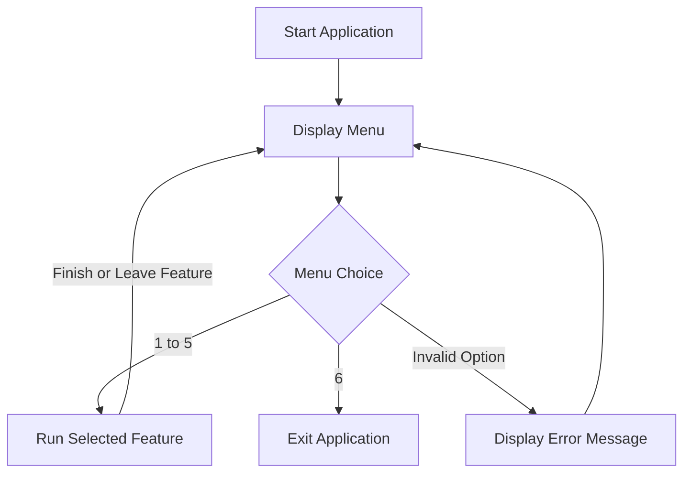

# Community Event Management System

A group Python application that helps staff manage community events and attendee registrations through a command-line menu.

## Objectives

The Community Event Management System aims to reduce reliance on paper forms and spreadsheets by providing one application for managing events and attendees.

The application allows staff to:

- View available events
- Register attendees
- View attendee lists
- Search for attendees
- Display event statistics
- Exit the application

---

## Features

### 1. View Available Events

Displays:

- Event name
- Date
- Event type
- Maximum capacity
- Remaining spaces

### 2. Register Attendees

Allows staff to register an attendee for an event.

The application checks:

- Whether the event has reached maximum capacity
- Whether the attendee is already registered

### 3. View Attendee Lists

Displays the registered attendees for each event.

A message is displayed if:

- No events are available
- An event has no registered attendees

### 4. Search for an Attendee

Searches registered attendees by name.

The search:

- Is not case-sensitive
- Supports searching using parts of a name
- Displays feedback when no attendee is found
- Rejects blank searches
- Remains active until the user enters `N`

### 5. Display Event Statistics

Displays overall statistics including:

- Total number of events
- Total capacity
- Total registrations
- Total spaces remaining

It also displays capacity, registrations and remaining spaces for each individual event.

### 6. Exit

Ends the application.

---

## Sample Events

The application includes three sample events:

| Event | Type |
| --- | --- |
| Painting Workshop | Workshop |
| 7-a-side Football | Sports |
| Charity Bake Sale | Fundraiser |

---

## How the Application Works

The application runs through a command-line menu. Options `1` to `5` run the corresponding feature, while option `6` exits the program.

The attendee search remains active until the user enters `N`.



---

## Team Contributions

### Qudratulla — Available Events and Menu

Developed the event display in `menu.py`, showing each event's:

- Name
- Date
- Type
- Capacity
- Remaining spaces

The menu presents all six options and provides feedback when an invalid option is entered.

### Luke — Attendee Registration

Developed `register_attendees.py`, allowing staff to select an event and enter an attendee's first and last names.

Added checks for:

- Full events
- Exact duplicate names

Valid registrations are added to the shared attendee list.

### Qurash — View Attendee Lists

Developed `view_attendees.py`, which loops through the shared events and displays registered attendees under each event name.

Added messages for situations where:

- No events are available
- An event has no registered attendees

### Bahaand — Shared Data, Search and Statistics

Prepared the shared event records in `data.py`.

Developed `search_attendees.py` to:

- Search attendee names without case sensitivity
- Handle blank searches
- Display feedback when no matches are found

Developed `display_event_statistics.py` to display:

- Overall event totals
- Individual event capacity
- Registration totals
- Remaining spaces

The group combined all features into one application using shared event data.

---

## Methodology and GitHub Collaboration

The application was developed using core Python concepts covered during the project:

- Variables and data types
- Lists
- Dictionaries
- Conditional statements
- Loops
- Functions
- Basic input/output

Event records are stored in a shared list in `data.py`.

Team members worked on individual feature branches and used descriptive commit messages. Pull requests were reviewed before integration into the `dev` branch, with **two approving reviews** required by the group's workflow.

Completed and reviewed work was then merged into `main`.

---

## Project Files

| File | Purpose |
| --- | --- |
| `main.py` | Runs the application loop and calls feature functions |
| `menu.py` | Displays menu choices, lists events and handles invalid options |
| `data.py` | Stores sample events and attendee lists |
| `register_attendees.py` | Displays booking options and registers attendees |
| `view_attendees.py` | Displays each event's attendee list |
| `search_attendees.py` | Searches registered attendee names |
| `display_event_statistics.py` | Displays overall and individual event statistics |

---

## How to Run

### Requirements

- Python **3.12 or later**
- No third-party Python packages are required

### Installation

Clone the repository:

```bash
git clone https://github.com/lparrysparta/Python-Project-Week-4.git
```

Move into the project directory:

```bash
cd Python-Project-Week-4
```

Run the application:

```bash
python3 main.py
```

> On Windows, you may need to use `python main.py` instead.

Choose a menu option from `1` to `6`. Run `main.py` to use the complete application.

---

## Testing Checklist

Use this checklist when testing changes:

- Event details and available spaces display correctly
- An attendee can be registered successfully
- A newly registered attendee appears in the attendee list
- An existing attendee can be found using search
- An unknown attendee produces the correct message
- A blank attendee search is handled correctly
- Full events prevent additional registrations
- Duplicate registrations are prevented
- Statistics update after a new registration
- Invalid menu entries display an error
- Option `6` exits the application correctly

---

## Future Development

Possible future improvements include:

- Permanent file storage
- Improved registration validation
- Improved attendee name formatting
- Cancellation of registrations
- Automated tests
- A graphical user interface (GUI)

These improvements could make the application more robust and easier for community staff to use.
