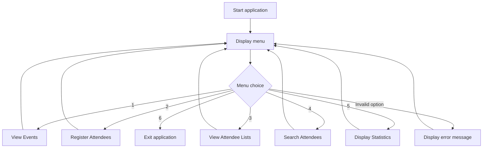

# Community Event Management System

A group Python application that helps staff manage community events and attendee registrations through a command line menu.

[GitHub Repository](https://github.com/lparrysparta/Python-Project-Week-4)

---

## Objectives

Reduce reliance on paper forms and spreadsheets by providing one application for:

- Viewing events
- Registering attendees
- Checking attendee lists
- Searching names
- Displaying event statistics

## Features

- **View events** — names, dates, types, capacity and remaining spaces
- **Register attendees** — with capacity and duplicate name checks
- **Display attendee lists** — per event, including messages for empty lists
- **Search attendees** — case-insensitive, returns to the menu on `N`
- **Display statistics** — overall and per-event
- **Exit** the application

Sample events: *Painting Workshop*, *7-a-side Football*, *Charity Bake Sale*.

## How the Application Works

Options 1–5 correspond to the features above. Search remains active until the user enters `N`.



## Team Contributions

| Member | Area | Contribution |
|---|---|---|
| **Qudratulla** | Available Events and Menu | Built the event display in `menu.py`, showing each event's name, date, type, capacity and remaining spaces. The menu presents all six options and gives feedback on invalid entries. |
| **Luke** | Attendee Registration | Built `register_attendees.py`, letting staff select an event and enter an attendee's first and last name. Added checks for full events and exact duplicate names before adding a registration. |
| **Qurash** | View Attendee Lists | Built `view_attendees.py`, looping through shared events to display registered attendees under each event name, with messages for no events or no attendees. |
| **Bahaand** | Shared Data, Search and Statistics | Prepared shared event records in `data.py`, built `search_attendees.py` for case-insensitive name search with feedback for blank/no-match entries, and `display_event_statistics.py` for overall and per-event stats. |

The group combined these features into one application using shared event data.

## Methodology and GitHub Collaboration

The application uses variables, lists, dictionaries, conditional statements, loops, functions and basic input/output. Event records are stored in a shared list in `data.py`.

Team members worked on individual feature branches with descriptive commit messages. Pull requests required **two approving reviews** before merging into `dev`, and completed work was then merged into `main`.

## Project Files

| File | Purpose |
|---|---|
| `main.py` | Runs the application loop and calls feature functions |
| `menu.py` | Displays menu choices, lists events, handles invalid menu options |
| `data.py` | Stores sample events and attendee lists |
| `register_attendees.py` | Displays booking options and registers attendees |
| `view_attendees.py` | Displays each event's attendee list |
| `search_attendees.py` | Searches registered attendee names |
| `display_event_statistics.py` | Displays overall totals and individual event statistics |

## How to Run

Requires **Python 3.12+** (the statistics module uses f-string syntax needing 3.12 or newer). No third-party packages required.

```bash
git clone https://github.com/lparrysparta/Python-Project-Week-4.git
cd Python-Project-Week-4
python3 main.py
```

Choose a menu option from 1 to 6.

## Testing Checklist

- [ ] Event details and available spaces display correctly
- [ ] Registering an attendee adds their name to the attendee list
- [ ] Search works for an existing name, an unknown name, and a blank entry
- [ ] Registration correctly blocks full events and duplicate names
- [ ] Statistics update correctly before and after registration
- [ ] Invalid menu entries are handled, and exit works via option 6

## Future Development

- Add permanent file storage
- Improve registration validation and name formatting
- Recalculate overall statistics on demand
- Support cancellation
- Introduce automated tests
- Explore a graphical interface
